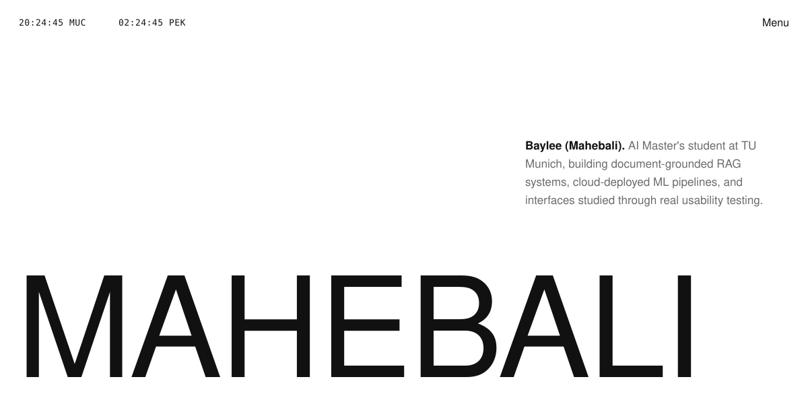
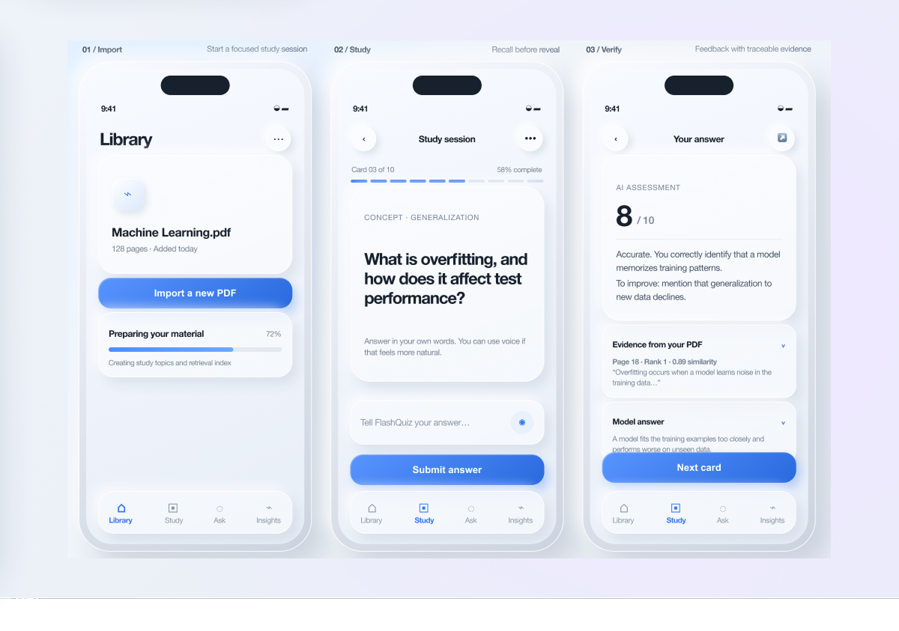
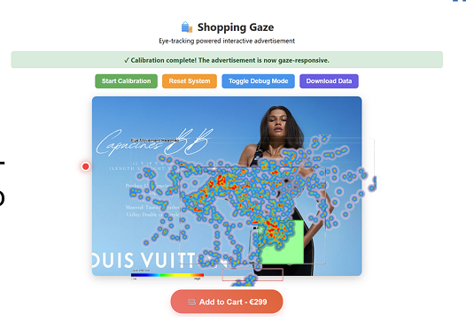

<!-- ───────────────  BAYLEE'S SAFE SPACE  ·  GitHub Profile README  ─────────────── -->
<!-- Layout: nav → intro → wordmark → stats band → projects → blog → contact -->
<!-- Style: monochrome editorial grid. One voice, no color, hairlines only. -->

<!-- Live clock version: deploy server/clock-svg.ts on Deno Deploy and swap the two
     srcset/src URLs below for  https://YOUR-PROJECT.deno.dev/?theme=dark  and  ?theme=light -->
<picture>
  <source media="(prefers-color-scheme: dark)" srcset="assets/header-dark.svg">
  
</picture>

PYTHON · PYTORCH · LANGCHAIN · DOCKER · AWS · TYPESCRIPT · FIGMA

---

<!-- ───────────────  PROJECT EXHIBITIONS  ─────────────── -->

## Project Exhibitions

<!-- Everything between PINNED:START and PINNED:END is rewritten by
     scripts/gen-pinned.mjs (.github/workflows/pinned.yml) from your pinned
     repositories. Edit the pins on your profile, not this block. -->
<!-- PINNED:START -->
<table width="100%">
<tr>
<td width="34%" valign="top">

I place the work at the centre of what I do — retrieval systems that
cite their sources, pipelines that survive deployment, and interfaces
tested with people who were not in the room when they were designed.

</td>
<td width="33%" valign="top">

CURRENT EXHIBITION 

### [ Flashquiz-rag]([https://github.com/makbal520](https://github.com/makbal520/flashquiz-rag))

Document-grounded Q&A and flashcard system using RAG pipeline (LangChain + ChromaDB + GPT). Every answer traces back to its source. Validated with real users — SUS score 78/100.

</td>
<td width="33%" valign="top">

CURRENT EXHIBITION 

### [AI Meeting Project]([https://github.com/makbal520/AI-meeting-based-on-LLM-project])

Multi-agent meeting platform built with n8n and LLM orchestration. Automates summaries, coaching, and follow-ups. Tested via A/B study and SUS evaluation.

</td>
</tr>
</table>
<!-- PINNED:END -->

<!-- Everything between PINNED:START and PINNED:END is rewritten by
     scripts/gen-pinned.mjs (.github/workflows/pinned.yml) from your pinned
     repositories. Edit the pins on your profile, not this block. -->
<!-- PINNED:START -->
<table width="100%">
<tr>
<td width="34%" valign="top">

</td>
<td width="33%" valign="top">

CURRENT EXHIBITION 

### [ Gaze-interactive]([https://github.com/makbal520/Gaze-interactive-E-commerce-Interface])

Eye-tracking UX experiment (Tobii, n=10) comparing dynamic vs. static ad design. Dynamic ads outperformed across fixation ratio, recall, and purchase intention — results validated with t-test.

</td>
<td width="33%" valign="top">

CURRENT EXHIBITION 

### [ Fake-News-Detection-Data analysis]([https://github.com/makbal520/Fake-News-Detection-using-Machine-Learning])

ML classification pipeline on 30,000+ news articles. 1,055 engineered features (TF-IDF, sentiment, similarity). Naive Bayes classifier with 92% test accuracy and AUC 0.98 — evaluated beyond accuracy with full precision/recall/F1 breakdown.

</td>
</tr>
</table>
<!-- PINNED:END -->

---

<!-- ───────────────  CONTACT  ─────────────── -->

## Contact

<table width="100%">
<tr>
<td width="40%" valign="top">

Open to research collaborations, ML engineering internships, and
conversations about evaluation — how we know a system is good before
it meets anyone.

</td>
<td width="30%" valign="top">

→ [Email](makbal327@gmail.com) 
→ [LinkedIn](http://www.linkedin.com/in/mahebali-jumabieke-baaa711ba) 
→ [CV / Résumé](#)

</td>
<td width="30%" valign="top">

→ [Now / Currently reading](#) 
→ [Notes archive](#) 
→ [TU Munich](https://www.tum.de)

</td>
</tr>
</table>

<table width="100%">
<tr>
<td align="left">MUNICH · CET</td>
<td align="center">M.Sc. Artificial Intelligence, TU Munich</td>
<td align="right">Last updated 2026</td>
</tr>
</table>
